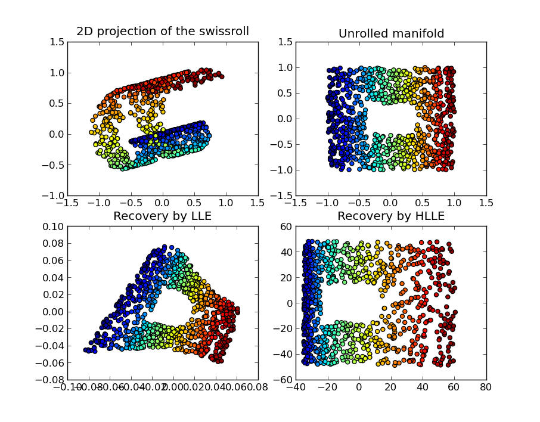
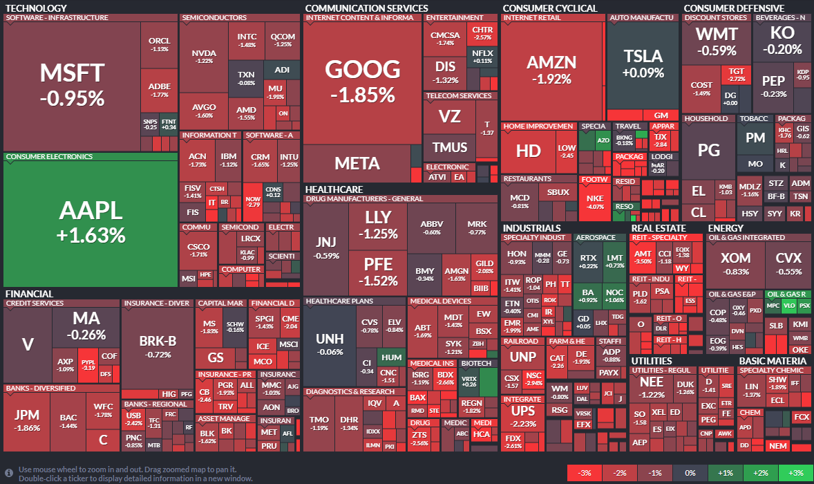
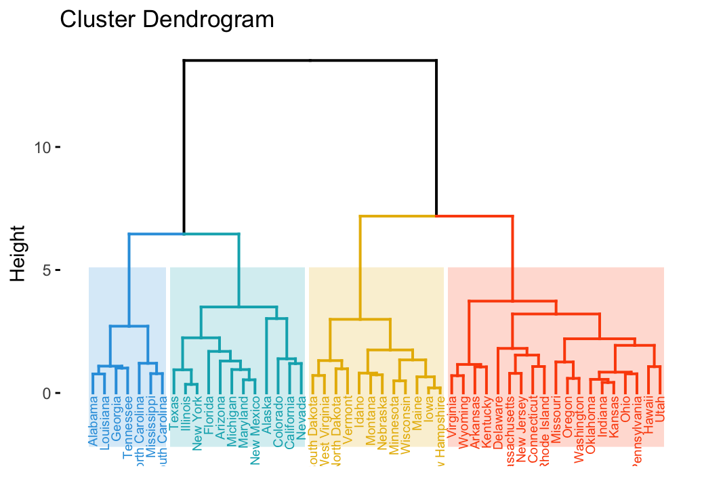
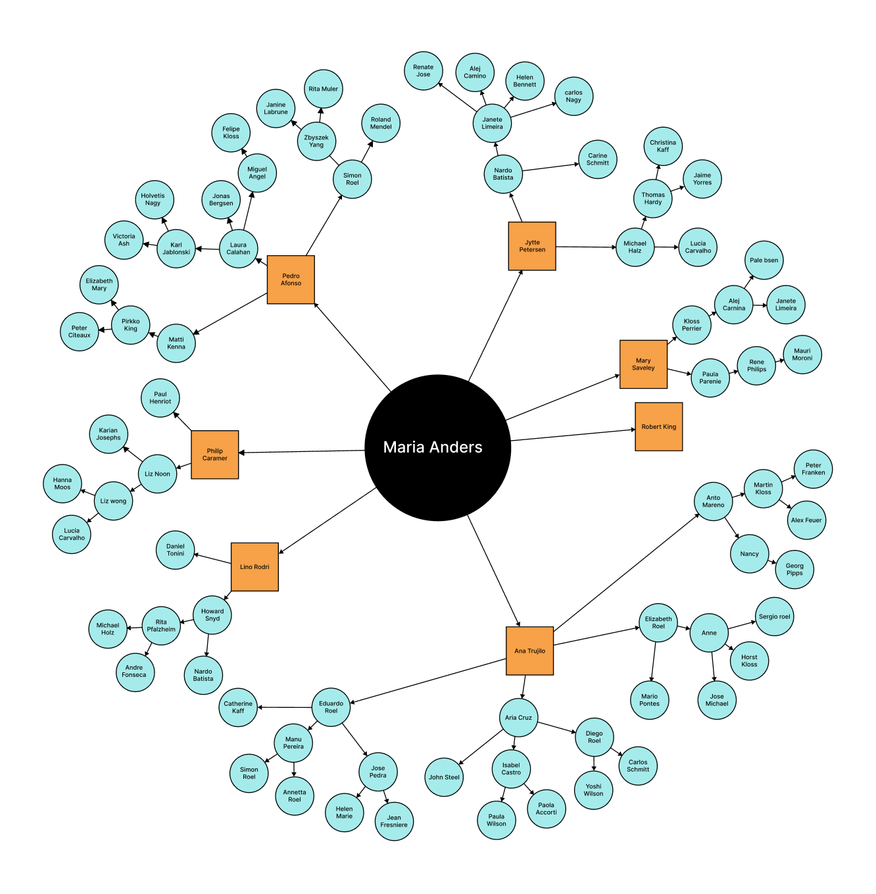
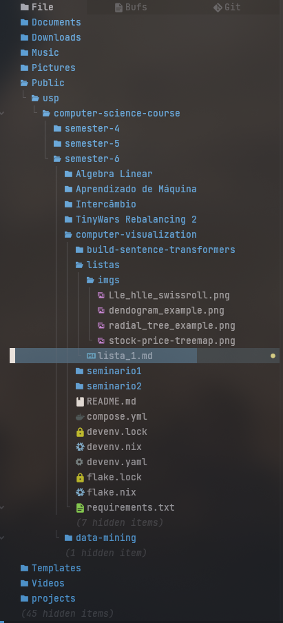
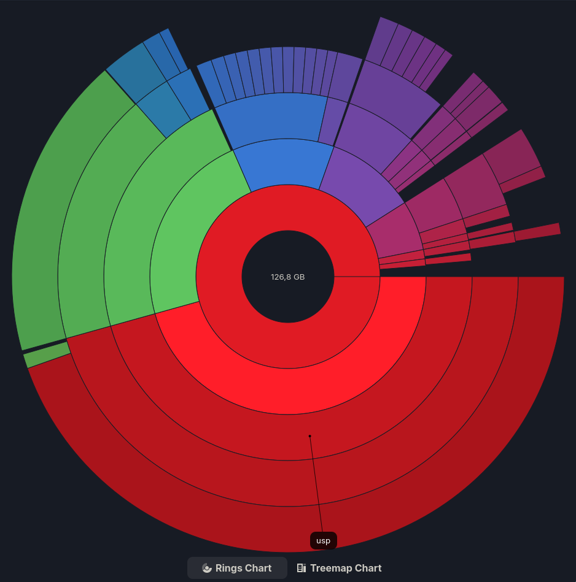

# Resolução da Lista "Visualização de dados"

## 1.

> Diferencie entre "Processamento de Imagens", "Visualização Computacional" e
> "Síntese de Imagens"

Em termos gerais, estes são três processos os quais lidam com imagens, mas para
diferentes finalidades:

- **Processamento de imagens:** transformar uma imagem _preexistente_ tendo em
  vista seu realce.

- **Síntese de imagens:** gerar imagens, sejam estas realísticas ou estilizadas,
  que emulam o aspecto visual de fenômenos naturais; como as formas dos objetos
  e a interação que estes possuem com a iluminação ao seu redor.

- **Visualização computacional:** gerar imagens as quais representam conceitos
  abstratos, como dados, de tal forma que sejam mais facilmente apreendidos e
  interpretados.

## 2.

> Como você percebe a distinção entre Visualização da Informação (InfoVis) e
> Visualização Científica (SciVis)?

- **Visualização Científica:** Representa dados referentes a fenômenos naturais,
  representando-os, ainda que parcialmente, em suas propriedades físicas e
  espaciais. Portanto, esta é uma forma de **visualização computacional** é
  pautada pela **síntese de imagens**.
- **Visualização da Informação:** Representa dados os quais são abstratos ou,
  senão, os representa de forma abstrata. Por conseguinte, não ocorre a
  representação física ou espacial.

## 3.

> Pense em uma situação em que você recebe um determinado conjunto de dados: em
> que cenários seria pertinente recorrer a algoritmos de Visualização? Quando é
> mais pertinente recorrer a algoritmos de Mineração de Dados?

Em primeiro lugar, é importante destacar que a Visualização e a Mineração de
dados são áreas complementares em um fluxo de análise de dados: a visualização é
frequentemente utilizada para orientar a mineração e, após esta, validar seus
resultados. Considerando os objetivos primários de cada uma e o emprego destas
em _situações específicas_ temos:

- Para a exploração dos dados é preferível a visualização pois:

  - Permite mais claramente identificar padrões a serem examinados;
  - Permite monitorar processos em tempo real;

- Para a modelagem de um problema, a mineração de dados é preferível pois:

  - Permite estruturar os dados de acordo com a necessidade de predição de um
    resultado futuro ou identificação de uma categoria.
  - Permite identificar Ocorrências anômalas ou raras

- Para validação do resultado de uma análise, a visualização é novamente
  preferível pois permite claramente testar hipóteses.

## 4.

> Como você percebe a associação entre Visualização e Ciência de Dados? Na sua
> percepção, qual é o papel da Visualização, no contexto de Ciência de Dados?

Posto simplesmente, a Ciência de Dados consiste no conjunto de métodos pelos
quais conhecimento pode ser extraído a partir de dados conjuntos de dados.
Enquanto a Visualização Computacional trata da representação de dados
visualmente, de maneira a melhorar sua compreensão dado o recurso visual. Assim
sendo, a relação entre estes âmbitos é profundamente simbiótica e crítica, pois
quando combinadas estes se reforçam mutuamente. A visualização computacional
leva o analista humano a uma melhor compreensão dos dados, o que por vez o leva
a gerar melhores modelos e hipóteses, que por vez são validados em
visualizações, que por vez pode levar a novos modelos, hipóteses ou a novas
análises.

## 5.

> A interatividade é considerada uma componente essencial da Visualização da
> Informação. Explique o porquê.

A interatividade é considerada componente essencial pois esta possibilita ao
usuário realizar de forma autônoma a exploração dos dados. Isto é, visualizações
estáticas fornecem apenas uma dada perspectiva pré-definida sobre os dados.
Enquanto visualizações interativas podem ser ajustadas conforme a conveniência
do usuário e a disponibilidade de novos dados.

## 6.

> No contexto de dados abstratos (não espaciais), quais os diferentes tipos de
> conjuntos de dados e as características de cada um? Quais os diferentes tipos
> de atributos de dados e as características de cada um?

São tipos de _conjuntos de dados_:

- **Dados tabulares:** os dados aqueles organizados em uma estrutura de linhas e
  colunas, onde cada linha corresponde a uma instância (ex.: uma observação, uma
  transação, ou um objeto) e cada coluna corresponde a um dado atributo presente
  nas instâncias (ex.: uma característica ou propriedade).

- **Grafos:** os dados aqueles organizados em uma estrutura de nós e arestas.
  Adequada a representar entidades e relações entre estas.

- **Dados Geométricos:** A representação de dados em um espaço coordenado
  genérico, frequentemente abstrato. Neste, instâncias podem ser representados
  por coordenadas e formas (pontos, linhas, polígonos) enquanto atributos destes
  são representados pelos alinhamentos que estes possuem com os eixos
  coordenados.

Enquanto são tipos de _dados_:

- **Dados categóricos:** os dados aqueles que não possuem um significado
  numérico. Dentre estes, encontramos os

  - **Nominais:** os quais não possuem ordem intrínseca;
  - **Ordinais:** aqueles que possuem.

- **Dados numéricos:** os dados aqueles que representam quantias mensuráveis.
  Dentre estes encontramos os

  - **Intervalos:** escalas numéricas sem um ponto 0
  - **Razões:** escalas numéricas com um ponto 0

## 7.

> Apresente duas maneiras de fazer o mapeamento visual (visual encoding) de
> dados categóricos para visualização, e discuta as suas limitações. Considere
> diferentes cenários para identificar as dificuldades associadas ao mapeamento
> de dados categóricos.

### Área, ou comprimento

Permite mapear grandezas quantitativas associadas às categorias, como somatória,
média, ou frequência. Este é um formato propício para a comparação destas
grandezas em função de relações de comprimento ou tamanho. É uma limitação
formato deste formato a inerente exigência de espaço para representar tais
relações de grandeza, especialmente quando estas são bastante díspares. Alguns
formatos como o gráfico de pizza resolvem este problema utilizando ângulos ao
invés de larguras para representar grandezas, o que inverte o problema:
grandezas similares passam a ser difíceis de se distinguir.

### Cor

Categorias podem ser facilmente distinguidas com o uso de cores. Cores,
entretanto estão limitadas em números de tonalidades que podem ser facilmente
distinguídas. Este problema é mais agravado quando considerada a possibilidade
de diferentes tipos de Daltonismo.

## 8.

> Qual a diferença entre uma tabela de cores sequencial e uma tabela de cores
> divergente? A que tipo de dados cada uma delas se aplica?

- **Tabela de cores sequencial:** compreende uma gradação entre duas cores, onde
  uma cor implica o ponto zero e a outra o ponto máximo.

- **Tabela de cores divergente:** compreende uma gradação entre três cores, onde
  uma cor implica o ponto mínimo, outra o ponto zero e mais outra o ponto
  máximo. Usualmente simétrica, em uma escala que abarca valores negativos e
  positivos.

## 9.

> Que cuidados ter ao escolher as cores a serem usadas na visualização?

Podemos elencar os seguintes tópicos:

1. **A natureza dos dados:**

   - **Categórico:** A paleta de cores deve ser tal que cores adjacentes sejam o
     mais distintiva quanto possível, sem implicar em gradações que venham a
     sugerir uma ordem a qual não está presente.
   - **Sequencial:** A paleta deve ter uma ordem perceptível que vai do claro ao
     escuro, ou do saturado ao desaturado, de tal forma que a ocorrência de uma
     progressão seja intuitiva.
   - **Divergente:** A peleta deve possuir duas tonalidades contrastantes que se
     encontram em uma cor neutra.

2. **Acessibilidade:** Pessoas com daltonismo possuem dificuldade para enxergar
   a determinadas tonalidades. Para circundar esta limitação, faz-se necessária
   a escolha de uma paleta de cores a qual evita as tonalidades mais
   problemáticas para este público.

3. **Interpretação e significado cultural:** A interpretação das cores
   empregadas na visualização está sujeita a implicações culturais e associações
   contextuais, o que pode levar a interpretações indevidas ou imprevistas.
   Neste quesito é útil aderir a convenções, mas atenção deve ser dada para não
   se reforçar esteriótipos.

4. **Implementação e reprodução:** Cores vibrantes as quais podem ser
   reproduzidas em um monitor raramente são passíveis de serem reproduzidas de
   maneria similar em impressões, ou projeções em locais onde há mais de uma
   fonte de luz.

## 10.

> Como os atributos de dados podem ser caracterizados quanto à semântica? Por
> que essa caracterização é importante para a visualização desses dados?

Uma distinção comum para atributos em função da semântica destes os caracteriza
em uma de três categorias:

- **Atributos dimensionais:** atributos os quais definem o contexto retratado
  pelos dados, respondem a perguntas como "onde?" e "como?". São variáveis
  independentes entre si os as quais podem ser utilizadas para agrupar, filtrar
  ou estruturar dados; em tabelas são frequentemente descritas em cabeçalhos de
  linhas ou colunas.

- **Atributos mensuráveis (ou valores):** atributos os quais representam um
  valor numérico quantificável, passível de ser analisado. Tratam-se das
  variáveis dependentes que são perpassadas pelos atributos dimensionais.

- **Atributos descritivos (ou metadata):** atributos os quais adicionam contexto
  ou descrição, mas não são usados diretamente para quantificação. Estes
  acrescentam texto ou categorias para auxiliar a descrição de uma dimensão.

A importância dessas categorias se dá, na visualização, no mapeamento a canais
visuais específicos, que informam da mesma. Por exemplo:

- Atributos dimensionais são usualmente mapeados a coordenadas no gráfico, como
  nos eixos cardinais.

- Atributos mensuráveis são mapeados a formas, cujo comprimento ou intensidade
  de cor está associado a sua gandeza.

## 11.

> Considere as seguintes técnicas de visualização: gráficos de dispersão,
> gráficos de linha e gráficos de barra.

> a. A que tipo de dados elas se aplicam?

- **Gráficos de dispersão:** representam diferentes entidades em função dos
  valores que estas possuem em dois atributos.

- **Gráficos de linha:** representam a relação entre dois valores observados em
  uma mesma entidade, em diferentes momentos.

- **Gráficos de barra:** pode ser utilizada para representar dados mensuráveis a
  cerca de dadas categorias, como somatória, média, etc.

> b. Explique em que medida elas permitem identificar: grupos de elementos com
> características em comum, correlações entre dois os mais atributos e outliers,
> i.e., itens de dados com valores atípicos.

- **Gráficos de dispersão:** A diferenciação ou similaridade das observações se
  dá em função do afastamento ou proximidade dos pontos no gráfico,
  respectivamente. Outliers figuram como pontos relativamente afastados com
  relação a todos os demais.

- **Gráficos de linha:** A diferenciação das observações se dá em função das
  diferenças de altura ou alinhamento dos pontos de dobra da linha. Outliers
  figuram na silhueta da linha como sendo picos ou vales.

- **Gráficos de barra:** A diferenciação das observações se dá em função dos
  comprimentos das barras. Outliers figuram como barras de comprimento
  discrepante.

> c. Quais as limitações de cada uma delas?

> d. Sugira, em cada caso, duas estratégias de minimizar essas limitações.

## 12.

> Dê exemplo de uma visualização que pode ser distorcida pela ocorrência de
> outliers nos dados, e explique por que isso ocorre.

No gráfico de linha a presença de outliers pode dramaticamente minimizar a
escala das demais observações, levando a um gráfico em que, senão pelos
outliers, as demais observações encontram-se planificadas. Quando isso ocorre,
torna-se bastante dificultoso ler a variação entre os pontos na maior extensão
do gráfico.

## 13.

Os atributos mapeados são categorias de produtos versus vendas por ano. Trata-se
de uma visualização que estaria melhor servida por um gráfico de linha para
explicitar o fator da continuidade em função do tempo.

## 14.

> Considere a visualização abaixo. As linhas mostram o número de ações
> executadas por (muitos) usuários em um site de comércio eletrônico, ao longo
> de um período de tempo. Sugira estratégias alternativas para visualizar esses
> dados que evitem o problema do overplotting e favoreçam a interação de um
> usuário, por exemplo, para observar comportamentos de usuários específicos, ou
> para identificar padrões de interesse.

Quando se tratando de observar o comportamento de usuários específicos, um
gráfico de linhas interativo pode oferecer opções de filtragem para minimizar o
número de usuários a serem exibidos a qualquer momento. Além disso, opções de
filtragem permitem observar de forma destacada os períodos aqueles em que
usuários demonstram um comportamento de interesse, seja pelo número de ações,
seja pelo período de tempo.

## 15.

Gráfico de barras divergentes:

- Representação estereotipada, em termos da escolha de cores, dos sexos
  masculino e feminino.

- Ausência de escala no eixo X

- Categorias pouco descritivas (A, B, C, D, E)

Gráfico de barras:

- Eixo y truncado (se estende de 5 à 6.4) pode induzir uma interpretação errônea
  da relativa magnitude dos valores sendo representados.

- O uso de diferentes tonalidades de uma mesma cor para representar categorias
  distintas é desincentivado, pois passa uma concepção de progressão onde esta
  não há.

## 16.

Há significativa quantia de sobreposição em regiões mais densamente urbanizada,
e muito espaço inutilizado em demais regiões. Neste caso, Talvez fosse
preferível o uso de um mapa do tipo clorophet para remover estas sobreposições,
ou hexbin para fazê-lo sem que regiões muito pequenas não sejam adequadamente
representadas em sua importância (embora isso acarrete em significativa
distorção geográfica).

## 20.

> Explique de que maneira a visualização de dados multivariados por heatmaps é
> afetada pela presença de outliers nos dados.

Outliers distorcem a escala do gráfico de tal forma que estes concentram a maior
parte da saturação de cores no mapa, e todas as demais observações aparecem com
tonalidades semelhantes.

## 21.

> Explique qual é a relação entre uma técnica de redução de dimensionalidade e
> uma técnica de projeção multidimensional.

Técnicas de projeção multidimensionais são capazes de representar múltiplas
dimensões em uma mesma visualização. Mesmo entre estas, entretanto, o número de
dimensões aptas a serem representadas simultaneamente é limitado. Neste sentido,
técnicas de redução de dimensionalidade são úteis para capturar o máximo de
variação nos dados quanto possível com um número limitado de dimensões para
representá-la.

## 22.

> Que propriedades um conjunto de dados multidimensional deve apresentar para
> que o PCA seja uma alternativa interessante para redução de dimensionalidade?

A técnica do PCA é adequada uso sobre dados contínuos e produz os melhores
resultados quando estes possuem uma estrutura linear. A mera presunção de
linearidade já é suficiente para justificar a aplicação desta técnica para fins
exploratórios.

## 23.

> Explique a diferença entre uma técnica de projeção global vs. local

Projeções globais são aquelas que, para acomodar a representação do conjunto de
dados como um todo, tolera a ocorrência de pequenas distorções entre estes. Por
vez, projeções locais são aquelas que, para representar de forma mais precisa a
relação entre um dado subconjunto de dados, permite que a representação do todo
seja distorcida. São técnicas de projeção global o PCA e o MDS, enquanto são
exemplos de projeções locais o t-SNE, o UMAP eo PHATE.

## 24.

> Explique a diferença entre uma técnica de projeção linear vs. não linear.

Técnicas de projeção linear são aquelas as quais podem ser produzidas pelo
processo da transformação linear (uma multiplicação de matrizes). As técnicas de
projeção não-linear, por outro lado, abarcam outros métodos de transformação
para, na ocorrência de estruturas cujos hiperplanos apresentam dobras,
"desdobrá-los" no processo de redução de dimensionalidade.

## 25.

> Discuta possíveis maneiras de avaliar a qualidade do resultado de uma projeção
> multidimensional aplicada um conjunto de dados.

A avaliação da qualidade de uma projeção estão sujeita aos objetivos da análise.
Assim sendo, a seguir sumarizamos alguns exemplos de objetivos e técnicas que os
atendem.

### Claramente separar grupos distintos

**t-SNE**, **UMAP** são técnicas eficientes para revelar as estruturas locais
dos grupos.

### Preservar o formato global

**PCA**, **UMAP** e **PHATE** são técnicas as quais preservam a disposição
geométrica dos dados.

### Estabilidade

Métodos não determinísticos como t-SNE e UMAP podem retornar resultados
distintos a cada execução, embora este último seja mais estável que este
primeiro. Enquanto isso, o **PCA** é perfeitamente estável.

Outras questões que se aplicam a todas as técnicas são: se a projeção reflete a
existência de classes conhecidas, se alguma; se a projeção faz sentido,
intuitivamente, com a ordenação esperada do conjunto de dados.

## 26.

> Quais as principais estratégias para visualizar hierarquias? O que as
> distingue? Dê um exemplo de aplicação típica de cada tipo de visualização que
> você mencionou

Em geral, hierarquias são habilmente representadas por estruturas de árvore, das
quais dispõe-se de uma variedade de soluções como _Treemaps_, _Dendogramas_,
_Árvores radiais_, _Árvores indentadas_, _Sunburst_, ou mesmo diagramas de rede
(os quais podem representar organizações hierárquicas ou não-hierárquicas).
Abaixo descrevemos a cada uma destas soluções:

### Treemap

Adequada a indicar a participação de cada nó da arvore em um dado valor total.
Tem como principais canais visuais a área e a cor.

### Dendogramas

Adequado a visualizar o resultado de um algoritmo de agrupamento em função de um
dado parâmetro de separação descrito em um dos eixos do Dendograma (usualmente o
vertical, que informa a altura do mesmo). Tem como principais canais visuais a
altura e as conexão entre as folhas.

### Árvores radiais

Uma forma eficiente em espaço para representar uma estrutura de árvore. Tem como
principais canais visuais ângulos e cores.

### Árvores indentadas

Uma forma eficiente de se acompanhar o caminho que leva da raiz a cada folha.
Têm como principais canais visuais a posição e alinhamento entre nós da árvore.

### Sunburst

Similar ao treemap, mas ordenado deforma radial

## 27.

> Considere a visualização por treemap na figura a seguir, que apresenta
> informações relativas à venda de diferentes produtos em um supermercado. O
> tamanho dos retângulos mapeia o total de vendas, a cor mapeia a margem de
> lucro média. (i) Quantos níveis de hierarquia estão representados, e qual a
> informação exibida em cada nível? (ii) Ordene as diferentes categorias de
> produtos em ordem decrescente de vendas. (iii) Mencione uma vantagem e uma
> desvantagem dessa representação dos dados.

1. Dois níveis de hierarquia: um para a categoria dos produtos e outro para a
   identificação de cada produto.

2. Organizadas em ordem decrescente de vendas, são as categorias representadas:

- _Produce_
- _Canned Priducts_
- _Deli_
- _Frozen Foods_
- _Snacks_
- _Dairy_
- _Baking Goods_
- _Beverages_
- _Starchy Foods_
- _Alcoholi..._

3. Esta trata-se de uma forma de visualização a qual é bastante eficiente de
   espaço, e identifica rapidamente os principais contribuidores a um valor
   total. Entretanto sua estrutura não é propícia para a realização de
   comparações: localizar e ordenar as categorias em ordem decrescente, por
   exemplo, necessitou de comparações entre áreas desalinhadas, com diferentes
   valores de altura e largura (os quais não obstante podem indicar uma mesma
   área).

## 28.

> No que consiste o posicionamento de pontos baseado em força (Force Directed
> Placement) para visualização de redes?

Trata-se de um algoritmo para o arranjo de nós da rede em um dado espaço, de
acordo com princípios físicos. Sejam

- os **nós** ímas com uma mesma polaridade.
- as **arestas** molas conectando os nós.

Nós tendem a afastar-se em função da atuação da força eletromagnética, ao mesmo
tempo que tendem a aproximar-se em função da atuação da tensão na aresta (a
mola) que os conecta. O algoritmo procede com a simulação destas forças até que
alcance um estado de estabilidade. Este simples algoritmo é eficiente pois leva
o estado final a uma condição que é considerada desejável para este tipo de
visualização:

- Minimiza o cruzamento de arestas;
- Torna mais uniforme o comprimento das arestas;
- Gera simetrias onde a atuação das forças é semelhante;
- Forma agrupamentos onde os nós encontram-se mais densamente conectados

## 29.

> Como o posicionamento baseado em forças pode ser usado como uma estratégia de
> projeção multidimensional?

A formação de agrupamentos onde nós são encontrados de forma mais densamente
conectados é uma característica bastante desejável na confecção de sociogramas,
pois identifica visualmente a ocorrência de comunidades.

## 30.

> Considere as representações matricial e diagrama de nós e arestas para
> visualização de grafos/redes. Nessas representações, como você diferenciaria
> entre redes simples (sem peso, não direcionais) redes com peso e não
> direcionais, rede sem peso e direcionais, e redes com peso e direcionais?
> Discuta.

Grafos são representados, enquanto matrizes $M$, na forma da matriz de
adjacências. Nesta, o peso das arestas é representado pelos valores armazenados
para cada elemento $M_{ij}$ da matriz. Quando este grafo não é direcionado, a
matriz encontra-se simétrica; doutra fora o grafo é direcionado.

Na visualização de redes, grafos são expressos em termos de nós e arestas. Nesta
visualização, pesos podem ser expressos utilizando legendas sobre as arestas, ou
na variação da espessura da aresta. Por outro lado, direcionamento pode ser
identificado com o uso de setas.

## 31.

> O que muda na visualização de redes quando a rede em questão é temporal? Quais
> as vantagens e desvantagens de cada técnica vista em sala?

A necessidade de representar os instantes de tempo em que as relações são
formadas. Em aula, vimos este fator ser abordado das seguintes maneiras:

- Indicando nas arestas os instantes de tempo em que cada relação foi formada.
  Esta trata-se da solução que em menos interfere no diagrama em sua versão
  estática, mas em redes complexas torna-se difícil perceber a sequência em que
  as ligações são formadas.
- O uso de animação ou uma série de fotografias para indicar o estado da rede em
  cada instante de tempo. Esta solução tem as mesmas qualidades da solução
  anterior e mitiga o problema da identificação da sequência de ligações, que é
  dada pela animação. Seu revés é sua maior complexidade de implementação e
  incapacidade para uso em mídias estáticas.
- A organização do grafo na forma de "Rede temporal", reorganizando o diagrama
  do grafo em torno de um eixo temporal. Sua qualidade é a representação
  estática, sequencial e organizada de uma progressão temporal, mas com o revés
  de possuir propensão a poluição visual, e mesmo sobreposição de arestas se a
  disposição dos nós não mitigar isto.

## 32.

> Defina poluição visual. Inclua, mas não restrinja sua resposta ao contexto de
> visualização de redes (relembre a visualização do exercício 14)

Poluição visual trata-se do excesso de informação representada em uma dada
visualização, de tal forma que torna-se contraproducente ao objetivo de se
extrair conhecimento a partir da informação. Frequentemente, ocorre quando a
diagramação não é capaz de comportar o volume de informação sem incorrer na
sobreposição dos elementos representados. Em redes, o excesso de arestas ou
pontos torna inviável estabelecer se a conexão entre dados pares de nós.

## 33.

> O que pode ser feito para melhorar os problemas de desordem na visualização da
> rede? O que pode ser feito para apoiar a análise visual de grandes redes?
> Responda as duas perguntas acima tanto para redes simples quanto redes
> temporais.

A ordenação dos nós da rede favorece a minimização de sobreposições e
identificação de agrupamentos, desde que a escolha do algoritmo de ordenação
seja adequada a tarefa. Quando se tratando de redes temporais, entretanto a
ordenação está limitada em função da sequência cronológica. (...)

## 34.

> Apresente o pipeline de visualização da informação, ressaltando como o usuário
> pode influenciar cada etapa.

## 35.

> Descreva cada forma de avaliação de visualizações a seguir, destacando suas
> diferenças, cuidados no uso e diferença de análise de resultados: (i) Estudos
> de caso (análise qualitativa), (ii) Análise quantitativa de resultados.

## 36.

> Que etapas realizar e que cuidados ter ao planejar, conduzir e avaliar os
> resultados de um estudo com usuários?

## 37.

> Diferencie um estudo com usuários do tipo between-subject de um estudo
> within-subjects.

## 38.

> Qual a importância dos testes estatísticos no contexto de avaliação de
> visualizações?

## 39.

> Como interpretar um gráfico de barras divergentes aplicado aos resultados de
> uma escala Likert?

## 40.

> Apresente o mantra da visualização e descreva, com suas palavras, como ele
> contribui para a análise visual de grandes conjuntos de dados Apresente o
> mantra da visualização e descreva, com suas palavras, como ele contribui para
> a análise visual de grandes conjuntos de dados.
