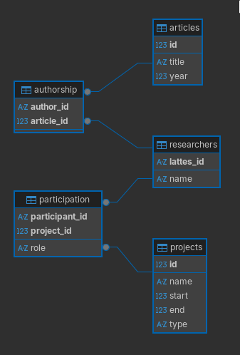
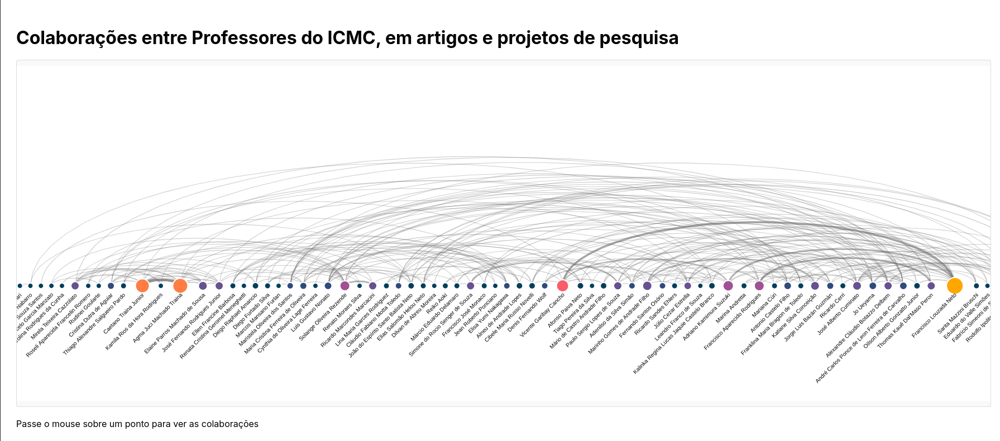
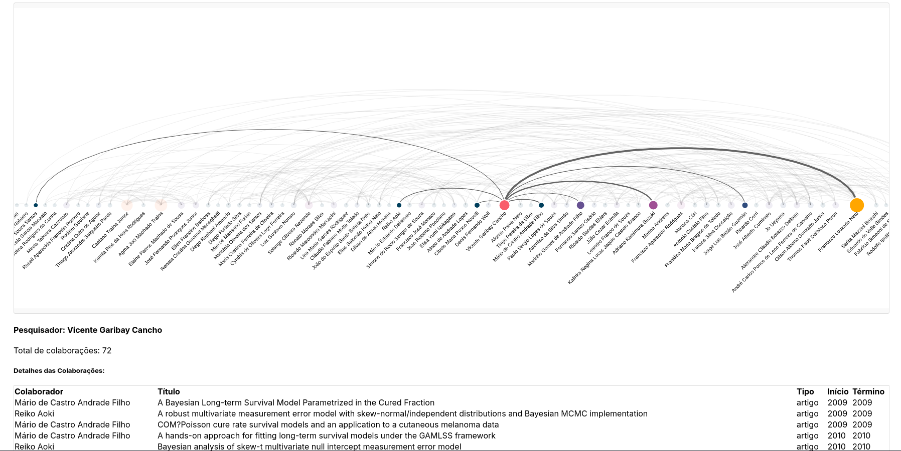
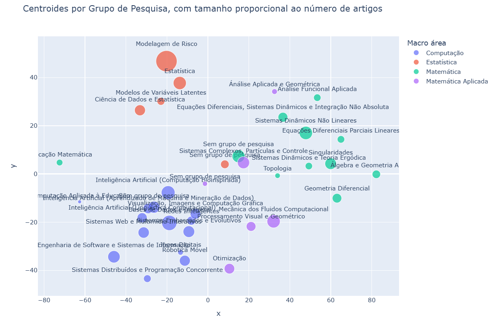
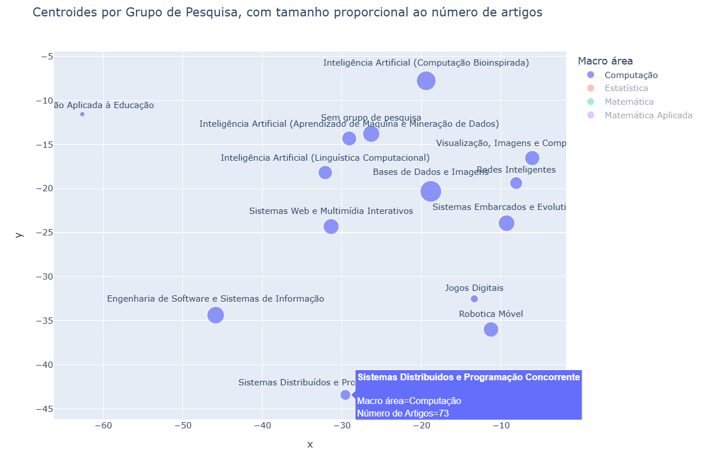

# Seminário 2: Geração e exploração de um banco de dados acerca dos pesquisadores do ICMC-USP

## Autores

| Nome                                      | nUSP     |
| :---------------------------------------- | :------- |
| Lucas de Oliveira Ferreira                | 13695042 |
| Guilherme de Abreu Barreto                | 12543033 |
| Jhonathan Oliveira Alves                  | 11838116 |
| Lucas Pereira Franco de Almeida           | 12675020 |
| Miguel Prates Ferreira de Lima Cantanhede | 13672745 |

## Sumário

<!--toc:start-->

- [Resumo](#resumo)
- [Introdução](#introdução)
- [Ambiente de desenvolvimento](#ambiente-de-desenvolvimento)
  - [Carregamento dos dados](#carregamento-dos-dados)
  - [Instalação de dependências](#instalação-de-dependências)
    - [Usando DevEnv](#usando-devenv)
    - [Usando `pip`](#usando-pip)
- [Webcrawlers](#webcrawlers)
- [Modelagem do Banco de Dados](#modelagem-do-banco-de-dados)
- [Visualizações](#visualizações)
  - [Diagrama de Arcos](#diagrama-de-arcos)
    - [Premissa](#premissa)
    - [Pré-processamento dos dados](#pré-processamento-dos-dados)
    - [Funcionalidades](#funcionalidades)
  - [Gráfico de Bolhas](#gráfico-de-bolhas)
    - [Premissa](#premissa)
    - [Pré-processamento dos dados](#pré-processamento-dos-dados)
    - [Funcionalidades](#funcionalidades)
  - [Gráfico de linhas](#gráfico-de-linhas)
- [Conclusões](#conclusões)
<!--toc:end-->

## Resumo

No presente trabalho, realizamos um estudo de caso onde, a partir de um
levantamento acerca dos pesquisadores do Instituto de Ciências Matemáticas e de
Computação da Universidade de São Paulo (ICMC-USP), avaliamos a produção destes
em termos (1.) do número de vezes em que estes colaboraram entre si; (2.) das
áreas do conhecimento e especializações abarcadas; (3.) e dos resultados
apresentatos em função do tempo. Para tal, empregamos e descrevemos técnicas
pelas quais pode ser feita a coleta, modelagem e finalmente a visualização
interativa de dados de maneira a favorável a análise dos mesmos.

**Palavras-chave:** _webscrapping_, banco de dados relacional, dashboards,
visualização de dados.

## Introdução

Conforme a proposta de seminário apresentada em enunciado, buscamos realizar um
levantamento de dados pertinentes a vivência universitária no ICMC. Em
particular, focamo-nos na exploração dos dados oferecidos pela plataforma
[Currículo Lattes](https://lattes.cnpq.br/), acerca da produção científica do
atual corpo docente deste instituto, conforme consta no
[site](https://ICMC.usp.br/pessoas) deste. Pretendeu-se, ao final, responder as
seguintes perguntas:

1. Quais projetos de pesquisa ou artigos científicos foram resultados da
   colaboração entre os pesquisadores do ICMC e,

   - quais os professores mais colaborativos?
   - com quem estes colaboram?
   - quantas vezes estes já colaboraram?

2. Como grupos de pesquisa diferentes do ICMC se relacionam entre si quando
   análisamos os títulos dos artigos publicados por seus membros docentes e,

   - quais os grupos com mais e menos artigos?
   - quais grupos possuem artigos que tratam de temas/áreas parecidas?

3. Qual a produtividade dos docentes em função do tempo e,

   - como esta se compara aos demais docentes deste mesmo instituto?

Para responder a estas perguntas realizamos uma pesquisa que consistiu em três
etapas: (1.) levantamento dos dados dos pesquisadores, (2.) estruturação dos
dados coletados em um banco de dados local, (3.) geração de visualizações
congruentes com os objetivos da análise. Neste relatório, descrevemos

- no tópico "Ambiente de desenvolvimento" destacamos as aplicações e bilbiotecas
  as quais utilizamos em nossa pesquisa, assim como obtê-las e executá-las;

- no tópico "_Webcrawler_" os programas que desenvolvemos tendo em vista a
  coleta (parcialmente) automatizada dos dados dos pesquisadores nos sites do
  instituto e da Plataforma Lattes;

- no tópico "Modelagem do Banco de Dados" a construção de um banco de dados
  relacional para o armazenamento estruturado destes dados;

- no tópico "Visualizações" a elaboração de _dashboards_ pelos quais realizamos
  a exibição destes dados em forma conveniente para responder aos nossos
  problemas de pesquisa;

Ao término de nossa pesquisa encontramos notável presença de colaboração entre
os docentes deste instituto, e alguns agrupamentos entre aqueles mais
colaborativos. Verificamos também que grupos de pesquisa que tratam de áreas
parecidas possuem produções científicas (artigos) que tratam de temas/áreas
semelhantes também.

> [!WARNING]
>
> Adicionar conclusões do Bom Dia

## Ambiente de desenvolvimento

Para gerar localmente as visualizações descritas neste relatório em um notebook
jupyter, ou mesmo modificar este projeto tendo acesso as mesmas ferramentas das
quais fizemos uso, faz-se necessário o carregamento de seus dados e a reprodução
do ambiente de desenvolvimento.

### Carregamento dos dados

Todos os dados e programas gerados nesta pesquisa encontram-se armazenados em um
[repositório git](https://github.com/de-abreu/visualizacao_computacional.git).
Recomenda-se que a obtenção destes seja feita diretamente pelo uso da ferramenta
git:

```bash
git clone https://github.com/de-abreu/visualizacao_computacional.git
```

> [!TIP]
>
> [Instruções para a instalação do git](https://github.com/git-guides/install-git)

### Instalação de dependências

#### Usando DevEnv

> Recomendado

Para instalar as dependências deste projeto de forma isolada e temporária,
utilize o seguinte comando a partir da raiz do projeto:

```bash
devenv shell
```

Para acessar um ambiente virtual com todas as dependências instaladas.

> [!TIP]
>
> [Instruções para a instalação do DevEnv](https://devenv.sh/getting-started/)

#### Usando `pip`

Instale as dependências python executando o seguinte comando na raiz do projeto:

```bash
pip install -r requirements.txt
```

Com isso já é possível acessar o jupyter notebook para executar as
visualizações. Entretanto, se se pretende reproduzir a raspagem dos dados no
site do ICMC e da Plataforma Lattes, ou a geração do banco de dados relacional a
partir destes dados, faz-se necessária a instalação do navegador Chromium (ou
outro baseado neste), o chromedriver, e SQLite. Recomenda-se que a instalação
destes requerimentos e o `pip` seja feita a partir do gerenciador de pacotes
disponível em seus sistema operacional.

## Webcrawlers

A raspagem de dados em nosso projeto foi feita nas seguintes etapas:

- Geração do arquivo `webcrawlers/docentes.csv` contendo os links para o
  Currículo Lattes dos docentes, extraídos do site do ICMC. Isso foi feito pela
  execução do script `webcrawlers/extracao_de_docentes.py`. Senão por três
  docentes para os quais tal link não constava, e por isso tiveram de ser
  buscados manualmente, todos os demais links foram capturados desta forma.

- Geração da lista de dicionários `webcrawlers/professores_all.pkl`, descrevendo
  os nomes dos docentes e seus respectivos projetos de pesquisa e artigos
  científicos; assim como os anos em que estes foram iniciados ou terminados.
  Esta raspagem de dados foi conduzida na plataforma Lattes usando o script
  `webcrawlers/lattes_crawler.py` de forma parcialmente automatizada, tido que
  Captchas necessitavam ser solucionados manualmente. Dois integrantes do grupo
  realizaram esta raspagem percorrendo a lista de professores em ordens
  alfabéticas opostas.

- Especificamente para o Gráfico de Bolhas, também foi feita a geração do
  arquivo `webcrawlers/ICMC_grupos_professores.csv` contendo os grupos de
  pesquisa e os professores que os compõe, extraídos do site do ICMC. Isso foi
  feito pela execução do script `webcrawlers/extracao_grupos_prof.py`. Dos 126
  docentes analisados 28 não constavam em nenhum dos 32 grupos de pesquisa no
  site do ICMC, esses professores em específico foram manualmente mapeados de
  acordo com o site do ICMC em sua grande área de atuação (Computação,
  Matemática, Matemática Aplicada e Estatística). Esse mapeamento foi armazenado
  em `webcrawlers/professores_sem_grupo.txt`.

## Modelagem do Banco de Dados

Com SQLite e a biblioteca SQLAlchemy geramos, pela transformação da lista de
dicionários dos docentes o arquivo `database/lattes.db`, um banco de dados
modelado conforme ilustra o seguinte diagrama.



O script utilizado para este propósito foi o `database/migration.py`

## Visualizações

As visualizações podem ser acessadas com o uso do jupyter notebook:

```bash
jupyter notebook seminario2/seminario2.ipynb
```

### Diagrama de Arcos

#### Premissa



> Visualização do Diagrama de arcos imediatamente após esta ter sido carregada

O Diagrama de arcos trata-se de uma visualização em que entidades são
representadas por pontos, enquanto relações entre estas são representadas por
arcos que os conectam. Assim sendo, esta trata-se de uma visualização adequada
para a representação de redes cujas relações se dão de forma não direcionada,
como é o caso das colaborações entre os docentes.

#### Pré-processamento dos dados

Nosso banco de dados foi prontificado a nos fornecer uma tabela cujas colunas e
tipos de dados são

| researcher_1 | researcher_2 | collaboration | type | start | end         |
| :----------- | :----------- | :------------ | :--- | :---- | :---------- |
| String       | String       | String        | Enum | Int   | Int ou NULL |

A diagrama de arcos, para ser gerado, faz uso das duas primeiras colunas apenas
para criar uma matriz simétrica $S_{n \times n}$ em que:

- $n$ é o número de pesquisadores distintos.
- $S_{ij} = S{ji}$ é o número de vezes em que o pesquisador $i$ colaborou em um
  projeto de pesquisa ou artigo científico com o pesquisador $j$.

tal que

- todo elemento $S_{ij} \ne 0$ corresponde a um arco, cuja espessura varia em
  função do seu valor normalizado.
- toda somatória $\sum^n_{k=1} S_{ik}$ corresponde a um ponto, cuja espessura
  varia em função do seu valor normalizado.

A ordem em que os pontos figuram no diagrama correspondem a ordenação espectral
[^1] das linhas da matriz, que garante uma sequência com a menor distância
possível entre nós altamente conectados. Como resultado, os arcos que conectam
os pontos são os menores possíveis e tendem a formação de grupos.

#### Funcionalidades

Não encontramos uma biblioteca que gerasse diagramas de arco dotados de
interatividade, então recorremos desenvolver nossa própria. Fizemos uso das
bibliotecas `pandas` e `numpy` para o pré-processamento dos dados, `plotly` para
a geração das formas geométricas, e `dash` para a atualização do diagrama
conforme interações do usuário via _callbacks_.



Nosso diagrama implementa uma interação quando o o usuário posiciona o mouse
sobre um ponto. Ao fazê-lo, todos os demais pontos e arcos não conectados a ele
têm sua opacidade reduzida, dando destaque apenas às conexões relevantes ao
pesquisador pelo ponto representado. Ainda, uma tabela sob o diagrama é
atualizada com os valores filtrados do Data Frame que lista os projetos para os
quais este pesquisador colaborou em ordem cronológica.

### Gráfico de Bolhas

#### Premissa



> Visualização do gráfico de bolhas imediatamente após este ter sido carregado

O gráfico de bolhas é um tipo gráfico de dispersão acrescido de uma dimensão
representada pelos tamanhos da bolhas. Assim como um gráfico de dispersão, ele
mapeia pontos (ou no caso bolhas) em um espaço bidimensional de acordo com as
variáveis representadas pelos eixos X e Y. No nosso caso as bolhas são grupos de
pesquisa e elas representam um conjunto de pontos que seriam artigos publicados
por professores daquele grupo, sendo a posição da bolha a média das posições dos
artigos e seu tamanho a quantidade de artigos que ela engloba. Nessa
visualização os eixos X e Y representam variáveis resultantes da redução de
dimensionalidade de embeddings dos títulos dos artigos, dessa forma a posição
dos artigos no gráfico representaria o quão semelhante seus títulos são uns dos
outros.

Esse tipo de representação é adequada para nossa proposta pois permite
identificar claras relações de proximidade/distância entre grupos de pesquisa
distintos, apenas utilizando dos artigos publicados dentro daquele meio. Assim
como perceber como se comportam grupos pertencentes a mesma macro área
(Computação, Matemática, Matemática Aplicada e Estatística) e quais grupos são
responsáveis por mais ou menos artigos publicados.

#### Pré-processamento dos Dados

Nosso banco de dados foi prontificado a nos fornecer uma tabela de artigos cujas
colunas e tipos de dados são:

| professor | article |
| :-------- | :------ |
| String    | String  |

Além disso, também foi feita a leitura do arquivo
`webcrawlers/ICMC_grupos_professores.csv` contendo a tabela de grupos no
seguinte formato:

| grupo  | professor |
| :----- | :-------- |
| String | String    |

Por fim, foi feita a leitura da tabela de macro áreas (Computação, Matemática,
Matemática Aplicada e Estatística) para professores sem grupo, contida no
arquivo `webcrawlers/professores_sem_grupo.txt` no formato:

| professor | macro  |
| :-------- | :----- |
| String    | String |

Depois de obter os dados, em um primeiro momento foram gerados embeddings dos
valores de todos os artigos, assim como dos valores únicos dos grupos de
pesquisa e das macro áreas usando "sentence-transformers/all-MiniLM-L6-v2",
valores que serão importantes posteriormente.

Em seguida relacionamos os artigos com os grupos ao qual pertencem por meio dos
professores, que são o atributo comum a ambas tabelas. No entanto, alguns
professores possuem mais de um grupo de pesquisa do qual fazem parte, nesse caso
como critério de desempate calculamos a similaridade de cosseno entre o
embedding do artigo e os embeddings dos grupos do qual o professor faz parte. A
tabela de artigos fica assim então:

| article | grupo  |
| :------ | :----- |
| String  | String |

Então é realizada a redução de dimensionalidade dos embeddings dos artigos
usando a técnica t-SNE. Os vetores de valor X e Y resultantes são então juntados
a tabela de artigos, fornecendo assim as coordenadas dos nossos pontos, ficando:

| article | grupo  | X     | Y     |
| :------ | :----- | :---- | :---- |
| String  | String | Float | Float |

A última etapa antes da visualização consiste em associar os valores das macro
áreas aos artigos. Isso é feito de duas maneiras, a primeira é mapeando os
artigos que possuem grupos de pesquisa com as macros correspondentes a estes
grupos, informação que foi pegada do site do ICMC e representada em formato de
dicionário. A segunda maneira se refere a artigos sem grupo de pesquisa, esses
são os artigos que na etapa de mapeamento de grupo estavam associados a
professores cuja informação do grupo não estava disponível. Nesse caso usamos os
dados da tabela de macro áreas, associando as macros diretamente aos artigos
desses professores. Também é feito uso da técnica de semelhança de cosseno entre
as embeddings do arquivo e das macro áreas nesse caso, pois alguns professores
possuem mais de uma macro área correspondente. Obtemos então:

| article | grupo  | macro  | X     | Y     |
| :------ | :----- | :----- | :---- | :---- |
| String  | String | String | Float | Float |

No final temos vários artigos, os grupos e macro áreas aos quais pertencem e a
posição XY que eles ocupam. Artigos de um mesmo grupo de pesquisa são então
agrupados em bolhas cuja posição corresponde a média das posições dos artigos e
o tamanho corresponde a quantidade de artigos que ela representa. O gráfico de
bolhas é então plotado com essas informações junto de uma legenda onde as cores
das bolhas representam a Macro área da qual fazem parte.

#### Funcionalidades

Para a geração do gráfico, optamos por usar a biblioteca `plotly`. Com ela além
de plotar adequadamente o resultado como mostra a figura anterior, foi possível
adicionar efeitos interativos que enriquecessem a visualização.



No nosso caso, ao passar o cursor por cima de uma bolha as informações acerca da
mesma são exibidas de forma clara, com o seu nome (indicando o grupo de pesquisa
que representa), a macro área ao qual ela faz parte e a quantidade de arquivos
que ela engloba. Além disso, ao clicar na legenda é possível isolar uma única
macro área facilitando muitas vezes uma análise mais precisa, já que o gráfico
se ajusta aos pontos exibidos, como mostra a imagem acima.

### Gráfico de linhas

> [!WARNING]
>
> Adicionar descrição por parte do Bom Dia

## Conclusões

Nossas visualizações foram capazes de responder às perguntas que se propuseram.

O diagrama de arcos revelou significativa interação entre os pesquisadores do
Instituto, onde a grande maioria destes (105 de 128), realizaram trabalhos
colaborativos pelo menos uma vez. Dentre estes, quatro pesquisadores se
destacaram como sendo os mais colaborativos: Francisco Louzada Neto (111
colaborações), Agma Juci Machado Traina (95 colaborações), Caetano Traina Junior
(85 colaborações) e Vicente Garibay Cancho. O diagrama nos permite identificar
grupos que frequentemente colaboram entre si, ressaltados pela largura dos arcos
e a posição que ocupam no diagrama. Dentre os pesquisadores já citados,
Francisco colabora com Vicente (36 ocasiões) mais que com qualquer outro
pesquisador, e por vez o mesmo é verdadeiro entre Agma e Caetano (53 ocasiões).

O gráfico de bolhas nos trouxe diversas informações acerca dos grupos de
pesquisa e de como eles se relacionam entre si. Foi mostrado que apenas com os
títulos dos artigos publicados pelo grupo é possível representar de maneira
satisfatória a posição que eles ocupam em um espaço 2d, no qual a proximidade
entre grupos representa semelhança em sua produção científica. Dessa forma
percebemos que grupos dentro de uma mesma macro área (Computação, Matemática,
Matemática Aplicada e Estatística) tendem a serem mais próximos, o mesmo vale
também para grupos dentro de macro áreas diferentes mas que tem algum aspecto
semelhante, como é o caso de "Educação Matemática" e "Computação Aplicada a
Educação". Também foi possível observar os grupos com mais e menos artigos que
foram "Modelagem de Risco" (567 artigos) e "Computação Aplicada a Educação" (17
artigos) respectivamente.

> [!WARNING]
>
> Adicionar conclusões das visualizações do Bom Dia

O acréscimo de novas formas de interações pode auxiliar nas visualizações. Por
exemplo, a adição de um _slider_ ao diagrama de arcos que permita a filtragem
por período de tempo pode permitir avaliar a ocorrência de colaborações se
avolumar em função do tempo, ou simplesmente tornar menos poluída a esta
visualização considerando um período.

No caso do gráfico de bolhas, a inserção de um zoom semântico pode facilitar a
visualização de bolhas que estejam muito próximas entre si, aumentando a
qualidade das análises que podem ser feitas em cima da visualização.

> [!WARNING]
>
> Adicionar possibilidades de novas interações para as visualizações do Bom Dia

[^1]: LEVY, Bruno; ZHANG, Richard. Spectral Geometry Processing. 1 jan. 2009.
